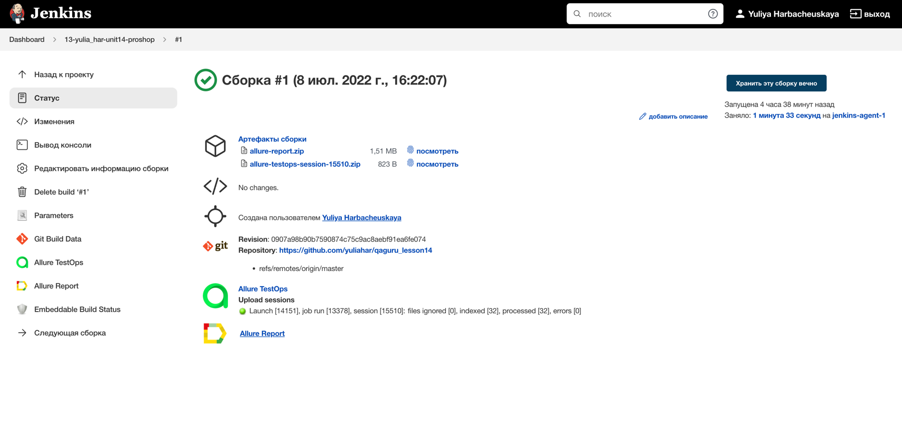

<h1 align="center"> UI tests with Selenide for ProShop eCommerce Platform</h1>

***ProShop is eCommerce platform built with the MERN stack for learning purposes.***

### **Table of Contents**  
- [**ProShop Functionality**](#proshop-functionality)
- [**Technologies and Tools**](#technologies-and-tools)
- [**Project Structure**](#project-structure)
- [**How To Use**](#how-to-use)
    - [**Configuration Files**](#configuration-files)
    - [**Run Tests with Gradle**](#run-tests-with-gradle)
        - [**Run All Tests**](#run-all-tests)
        - [**Run Test Suite**](#run-smoke-tests)
    - [**Run Tests with Jenkins**](#run-tests-with-jenkins)
      - [**Run with Parameters**](#run-with-parameters)
      - [**Jenkins Job**](#jenkins-job)
    - [**Allure Report**](#allure-report)
        - [**Generate Report via Terminal**](#generate-report-via-terminal)
        - [**Report in Jenkins**](#report-in-jenkins)
        - [**Telegram Notifications**](#telegram-notifications)
        - [**Slack Notifications**](#slack-notifications)
    - [**Integration with Allure TestOps**](#integration-with-allure-testops)
    - [**Integration with Jira**](#integration-with-jira)
    - [**Video of Tests Execution**](#video-of-tests-execution)

## 🛍️ **ProShop Functionality**
* Auth: login, register, login with Facebook / Google
* Full-featured shopping cart
* Product reviews and ratings
* Top products carousel
* Product pagination
* Product search feature
* User profile with orders
* Admin product management
* Admin user management
* Admin order details page
* Mark orders as a delivered option
* Checkout process (shipping, payment method, etc)
* PayPal / credit card integration

> Note: for now only some tests for the signup functionality have been automated.

## 🛠️ **Technologies and Tools**

<p align="center">
<a href="https://www.java.com/"></a>
<a href="https://junit.org/junit5/"></a>
<a href="https://selenide.org/"></a>
<a href="https://aerokube.com/selenoid/"></a>
<a href="https://gradle.org/"></a>
<a href="https://www.jenkins.io/"></a>
<a href="https://github.com/allure-framework/allure2"></a>
<a href="https://qameta.io/"></a>
<a href="https://www.atlassian.com/software/jira"></a>
<a href="https://telegram.org/"></a>
<a href="https://slack.com/"></a>
<a href="https://github.com/"></a>
<a href="https://www.jetbrains.com/idea/"></a>
</p>

## 📌 **Project Structure**

```aidl
├── README.md
├── build.gradle
├── gradle
│   └── wrapper
│       ├── gradle-wrapper.jar
│       └── gradle-wrapper.properties
├── gradlew
├── gradlew.bat
├── notifications
│   ├── commands.txt
│   ├── slack.json
│   └── telegram.json
└── src
    └── test
        ├── java
        │   └── com
        │       └── proshop
        │           ├── config
        │           │   ├── Project.java
        │           │   └── ProjectConfig.java
        │           ├── data
        │           │   └── User.java
        │           ├── helpers
        │           │   ├── AllureAttachments.java
        │           │   ├── DriverSettings.java
        │           │   └── DriverUtils.java
        │           ├── pages
        │           │   ├── HomePage.java
        │           │   ├── LoginPage.java
        │           │   └── RegisterPage.java
        │           ├── tests
        │           │   ├── BaseTest.java
        │           │   ├── LoginTests.java
        │           │   └── SignupTests.java
        │           └── utils
        │               └── RandomUtils.java
        └── resources
            └── config
                ├── local.properties.example
                └── remote.properties.example

```

## ▶ **How To Use**
### 🔨 **Configuration File**
```properties
browser=[BROWSER] (chrome by default)
browserVersion=[BROWSER_VERSION] (100.0 by default)
browserSize=[BROWSER_SIZE] (1920x1080 by default)
baseUrl=[BASE_URL] (https://dev-proshop.herokuapp.com by default)
remoteDriverUrl=https://[selenoidUser]:[password]@[REMOTE_DRIVER]/wd/hub/
videoStorage=https://[REMOTE_DRIVER]/video/
```

### ▶️ **Run Tests with Gradle**

#### **Run All Tests**
```shell
gradle clean test
```

#### **Run Test Suite**
You can run a specific test suite by running appropriate task (in build.gradle for specific tags):
* smoke
* regression
* signup
* ui
```shell
gradle clean smoke
```

### ▶ **Run Tests with Jenkins**

#### **Build Parameters**
```properties
BASE_URL=[BASE_URL] (https://dev-proshop.herokuapp.com by default, available options: https://dev-proshop.herokuapp.com, https://qa-proshop.herokuapp.com)
TASK=[TASK] (test by default, available options: test, signup, smoke, regression, ui)
BROWSER=[BROWSER] (chrome by default, available options: chrome, firefox, opera, safari)
BROWSER_VERSION=[BROWSER_VERSION] (100.0 by default, available options: 100.0, 99.0, 98.0, 91.0)
BROWSER_SIZE=[BROWSER_SIZE] (1920x1080 by default, available options: 1920x1080, 1600x1200, 1366x768, 1024x768)
REMOTE_DRIVER=selenoid.autotests.cloud
THREADS=5
ALLURE_NOTIFICATIONS_VERSION=2.2.3
```

#### **Run with Parameters**
<p align="center">  
<a href="https://jenkins.autotests.cloud/job/13-yulia_har-unit14-proshop/build?delay=0sec"></a>  
</p>

#### <a target="_blank" href="https://jenkins.autotests.cloud/job/13-yulia_har-unit14-proshop/">**Jenkins Job**</a>
<p align="center">  
<a href="https://jenkins.autotests.cloud/job/13-yulia_har-unit14-proshop/"></a>  
</p>

## 📌 **Allure Report**

### 📃 **Generate Report via Terminal**
> In order to generate a report, you need to run the following command:
```shell    
allure serve build/allure-results
```
<p align="center">  
<a href="https://jenkins.autotests.cloud/job/13-yulia_har-unit14-proshop/1/allure/#suites/c892e19698e7ad18ba75a57ef4e102f4/55260725fb10287a/"></a>  
</p>

### 📄 **Allure Report in Jenkins**
> For every build, the Allure report is generated automatically in the build directory.
<p align="center">  
<a href="https://jenkins.autotests.cloud/job/13-yulia_har-unit14-proshop/1/allure/#suites/c892e19698e7ad18ba75a57ef4e102f4/55260725fb10287a/"></a>  
</p>

### ✉️ **Telegram Notifications**
> After build completion, the build status is sent to the Telegram channel.
<p align="center">  
<a href=""></a>  
</p>

### 💌 **Slack Notifications**
> After build completion, the build status is sent to the Slack channel.
<p align="center">  
<a href=""></a>  
</p>

## 📌 **Integration with Allure TestOps**
> The Allure TestOps is used as Test Management tool: to work with test artifacts, 
> create and run test suites, and to track test results.
<p align="center">  
<a href="https://allure.autotests.cloud/project/1444/dashboards"></a>  
</p>
<p align="center">  
<a href="https://allure.autotests.cloud/project/1444/launchess"></a>  
</p>

## 📌 **Integration with Jira**
> Allure Testops is integrated with Jira. All test runs or test cases can be assigned with Jira issue. 
<p align="center">  
<a href="https://jira.autotests.cloud/browse/AUTO-1196"></a>  
</p>

## 🎬 **Video of Tests Execution**
> Every test has attached video, screenshots and logs. One of video you can see below:
<p align="center">
  
</p>